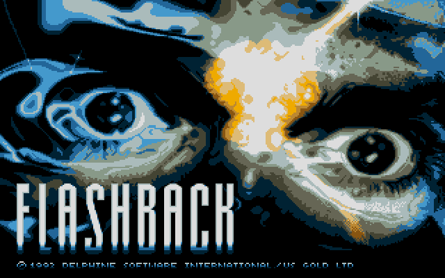

# REminiscence — Atari ST



Flashback ported to Atari ST by [Neil Rackett](https://neilrackett.com/atarist).

## Introduction

Of all the games that were never released on the Atari ST, there are a few
that I was most disappointed about: one of those was Flashback.

Say hello to _Flashback_ for Atari ST.

This port brings Flashback to the Atari ST for the very first time using the
planar-native [STDL](https://github.com/neilrackett/atarist-stdl)
framework (the `stdl/` submodule) and Amiga data files via
[REminiscence](https://github.com/cyxx/REminiscence), a re-implementation
of the game engine for Flashback by Delphine Software, released in 1992.

- Sound effects are STE-only (silent on a regular ST).
- Requires 2MB RAM.

## Installing

1. Extract the data files from the Amiga disk images (see below).
2. Copy `FLASHBAK.TOS` and the `DATA\` folder to your ST's hard disk.
3. Run `FLASHBAK.TOS` from the desktop.

The game loads its files from `DATA\` and writes savestates
(`RS<level>_<slot>.SAV`) and `RS.LOG` in the program folder. Options can be
set in `RS.CFG` (same `key=value` format as the SDL build's `rs.cfg`).

## Controls

| Key             | Action                            |
| --------------- | --------------------------------- |
| Arrow keys      | move Conrad                       |
| Shift           | talk / use / run / shoot          |
| Enter           | use the current inventory object  |
| Backspace / Tab | display inventory / skip cutscene |
| Escape          | display options                   |
| Ctrl S / Ctrl L | save / load game state            |
| Ctrl + / Ctrl - | change game state slot            |
| Ctrl Q          | quit                              |

A joystick in port 1 maps to the arrow keys with fire as Shift.

## Building

With [atarist-toolkit-docker](https://github.com/sidecartridge/atarist-toolkit-docker)
installed:

```
git submodule update --init
stcmd make
```

This produces `dist/FLASHBAK.TOS`.

The desktop SDL2 build is still available via `make -f Makefile.sdl`.

## Data files

The Atari ST build uses the data files from the Amiga release,
placed in a `DATA\` folder next to `FLASHBAK.TOS` with uppercase
names (`replicant.spm` renamed to `REPLICAN.SPM` for GEMDOS 8.3).
`tools/extract-data.sh` extracts and lays them out directly from
CAPS/SPS `.ipf` disk images — see [tools/README.md](tools/README.md).

If you can't find your original Amiga disks, try the
[TOSEC Commodore Amiga collection](https://ia600803.us.archive.org/view_archive.php?archive=/21/items/Commodore_Amiga_TOSEC_2012_04_10/Commodore_Amiga_TOSEC_2012_04_10.zip).

Other platforms' data files (DOS floppy/CD, Macintosh `FLASHBACK.BIN`
/ `FLASHBACK.RSRC`, PC98, SegaCD `VOICE.VCE` for speech, `.mod`
music sets [4]) are supported by the SDL build — see the upstream
[README](https://github.com/cyxx/REminiscence) for details.

## To-do

- Non-STE sound effects
- Music
- More speed!

## Credits

- [Gregory Montoir for REminiscence](https://github.com/cyxx/REminiscence).
- Delphine Software, obviously, for making another great game.
- Yaz0r, Pixel and gawd for sharing information they gathered on the game.

## More info

If you'd like more information about Flashback:

- [1] http://www.mobygames.com/game/flashback-the-quest-for-identity
- [2] http://en.wikipedia.org/wiki/Flashback:_The_Quest_for_Identity
- [3] http://ramal.free.fr/fb_en.htm
- [4] https://www.exotica.org.uk/wiki/Flashback
