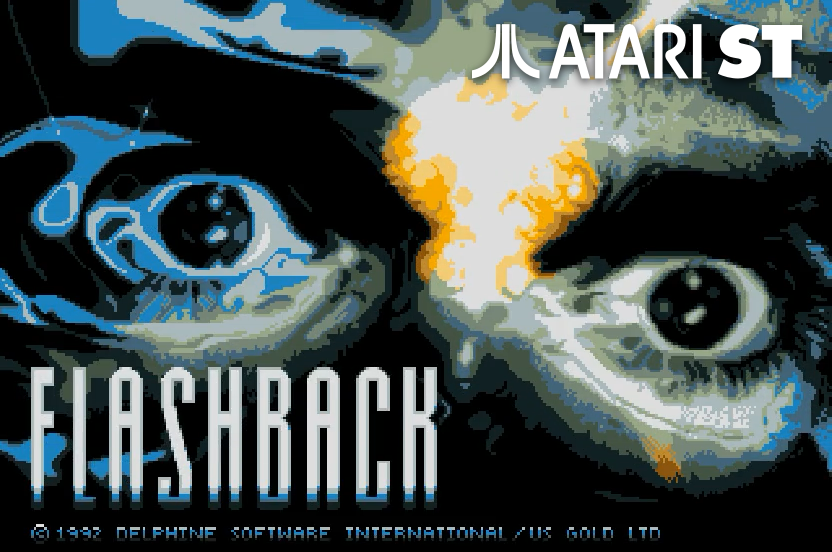

# Flashback for Atari ST



Flashback ported to the Atari ST via [REminiscence](https://github.com/cyxx/REminiscence),
by [Neil Rackett](https://neilrackett.com/atarist).

## Introduction

Of all the games that never had an official release on the Atari ST, one of
the ones I was most disappointed about was Flashback (Delphine Software, 1992).

Using [STDL](https://github.com/neilrackett/atarist-stdl) and the Amiga
data files, I've ported [REminiscence](https://github.com/cyxx/REminiscence),
Gregory Montoir's re-implementation of the original game engine, to the Atari ST.

So, just three decades after the original was released... **_Say hello to Flashback for the Atari ST._**

## Requirements

- Needs an ST with at least 2.5MB RAM (4MB recommended).
- 3.5MB of hard disk space.
- Sound effects: the Amiga's samples on an STE, simpler YM versions on any other ST.
- Optional music works on any ST, and an STE plays the original Amiga score (see below).

Sorry, 2MB isn't enough: with a hard disk driver loaded, the larger levels run out of memory.

## Installing

1. Copy `FLASHBAK.TOS` (and optionally `RS.CFG`) to your ST's hard disk.
2. Extract the data files from your Amiga installation disks using the [RExtract online tool](https://labs.neilrackett.com/web-rextract/).
3. Copy the `DATA` and `MUSIC` folders into the same folder as `FLASHBAK.TOS`.
4. Run `FLASHBAK.TOS`.

If you would prefer to extract the data manually, see
[Extracting the files manually](docs/extracting-files.md).

Saved games (`RS<level>_<slot>.SAV`) and `RS.LOG` live in the program folder.
The default `RS.CFG` includes all of the available options (see [Configuration](docs/configuration.md)).

## Controls

You can control Conrad with the keyboard, a joystick in port 1, or a gamepad:

| Key             | Joystick   | Gamepad                  | Action                           |
| --------------- | ---------- | ------------------------ | -------------------------------- |
| Arrow keys      | Directions | D-pad / left stick       | move Conrad                      |
| Shift           | Fire       | A                        | talk / use / run / shoot         |
| Enter           |            | B, right shoulder        | use the current inventory object |
| Backspace / Tab |            | Y, Select, left shoulder | display inventory                |
| Space           |            | X                        | toggle the gun on / off          |
| Escape          |            | Start                    | display options                  |
| Any key         | Fire       | Any button               | skip the current cutscene        |
| Ctrl S / Ctrl L |            |                          | save / load game state           |
| Ctrl + / Ctrl - |            |                          | change game state slot           |
| Ctrl Q          |            |                          | quit                             |

Gamepads are supported via [Xpad](https://downloads.neilrackett.com/atarist-xpad)
providers, including [MD/Sidepad](https://downloads.neilrackett.com/md-sidepad).

Save, load, quit and the state-slot keys stay on the keyboard: they are
Ctrl combinations, and a pad button emulates a single key.

On the title menu, **Start** lists the levels: fire on one plays it, and
Back (or Escape) returns to the menu. The list opens on the level last
played - the Jungle, when the game has just been started - so Start and
fire begin a new game.

**Load Game** picks up a saved game: left and right step
through the ones on disk, starting with the most recent, and fire loads it.
A level's save point is listed along with the slots saved with Ctrl+S or
from the in-game menu.

**Options** holds the skill level, the screen mode, the
refresh rate, the music and its volume: left, right or fire changes a
setting, and Back (or Escape) returns to the menu. Changes last for the
current run; `RS.CFG` sets where they start (see [Configuration](docs/configuration.md)).

At 60Hz most monitors draw the picture taller, so Fit comes close to the
height the overscan modes give. The overscan modes themselves always run at
50Hz, and some PAL TVs won't show 60Hz at all.

## Data files

**Flashback is still copyright Delphine Software, so you'll need to extract the
files needed from your legally owned original Amiga installation disks.**

The easiest way to extract the data files from your Amiga installation disks
in the correct format is to use the [RExtract online tool](https://labs.neilrackett.com/web-rextract/).

To extract them by hand instead, see
[Extracting the files manually](docs/extracting-files.md).

### Music

Music is still experimental and so remains optional.

The score is on the disks, in `music/` — one ProTracker module per
track. An STE or Mega STE plays the modules as they are, on its DMA
sound. Every other ST plays YM2149 versions of them, converted
offline: a chip cover rather than the original, since three square
waves keep the notes but not the instruments.

The [RExtract online tool](https://labs.neilrackett.com/web-rextract/)
puts both in the `MUSIC` folder. By hand, `tools/extract-data.sh` (see
[Extracting the files manually](docs/extracting-files.md)) puts the
modules in `tmp/music`, and `tools/make-music.sh` with no arguments
copies each module into `dist/MUSIC` and converts it there too. Copy
that `MUSIC\` folder to your ST, next to `FLASHBAK.TOS` and alongside
`DATA\`.

Music then plays by default: an STE plays the modules and any other ST
the YM versions. On an STE, Options on the title menu switches between
the two; `music=ym` in `RS.CFG` starts with the YM versions, and
`music=false` turns music off.

The modules are not free on an STE: mixing four sampled voices takes
about a quarter of the machine, so cutscenes slow down with them more
than with the YM versions.

Without the music files the game plays as it always did: each
missing track is noted once in `RS.LOG` (with `logging=true`) and the
scene runs silent.

## Custom palettes

You can replace the 16 colours the game picks for each room with your own:
see [Custom palettes](docs/custom-palettes.md).

## Configuration

Options go in `RS.CFG`, a plain text file next to `FLASHBAK.TOS`: see
[Configuration](docs/configuration.md) for every one of them.

## Work in progress

While the game is now pretty much feature complete, it is still a work in progress.

### Feedback

Please [submit an issue](https://github.com/neilrackett/atarist-reminiscence/issues)
or [open a pull request](https://github.com/neilrackett/atarist-reminiscence/pulls)
if you find anything that doesn't work or if you'd like to contribute to make it better.

Please ensure that you include as much information as possible in your submission,
including:

- The Atari ST model and TOS version (ST, STE, Mega ST, Mega STE)
- Whether you are using an emulator (e.g. [Hatari](https://www.hatari-emu.org/)) or real hardware
- The amount of RAM you have installed
- Any devices you have connected
- The exact steps to reproduce the issue
- Any error messages or logs you see

### To-do

- Can we achieve smooth cutscenes playback without dropping frames?

## Building

With [atarist-toolkit-docker](https://github.com/sidecartridge/atarist-toolkit-docker)
installed:

```
git submodule update --init
stcmd make
```

This produces `dist/FLASHBAK.TOS`.

The desktop SDL2 build is still available via `make -f Makefile.sdl`.

## Credits

- A massive thank you to [Gregory Montoir for REminiscence](https://github.com/cyxx/REminiscence) and agreeing to let me use it.
- A big thank you to everyone on [X](https://x.com/neilrackett) and [Atari Forum](https://www.atari-forum.com/viewtopic.php?t=46425) who helped with testing and refining the colour palette.
- Delphine Software, obviously, for making another great game.
- Yaz0r, Pixel and gawd for sharing information they gathered on the game.

## More info

If you'd like more information about Flashback:

- [1] http://www.mobygames.com/game/flashback-the-quest-for-identity
- [2] http://en.wikipedia.org/wiki/Flashback:_The_Quest_for_Identity
- [3] http://ramal.free.fr/fb_en.htm
- [4] https://www.exotica.org.uk/wiki/Flashback

## License

**This repository is not open source.**

The REminiscence engine is copyright
[Gregory Montoir](https://github.com/cyxx) with no OSS licence — parts of
it are a direct translation of the game's disassembly, so none fitted.
This port exists by his express permission, given to me for this port
and not as a licence to you: to reuse the engine, ask him. Core-engine
changes made here are listed in [CHANGES.txt](CHANGES.txt), as requested.

Atari ST port related code is copyright (C) 2026 Neil Rackett

[STDL](https://github.com/neilrackett/atarist-stdl), the display and audio
library underneath, is a separate project under LGPL-2.1-or-later.

Flashback and its data files are copyright Delphine Software; no game data
is distributed here.
